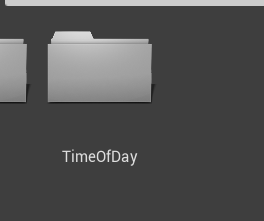

# Quick tutorial on how to mod older versions of Fortnite.

## 1. Download the UE4 build that the Fortnite version you want to mod uses. 

- (For Season 4 i recommend using 4.19 as custom maps work on it, and for 7.10/7.30, 4.21.)

> How to check what UE4 build the Fortnite version i want to mod uses?


## 2. After you download Unreal Engine, open it and create a new blank project called "FortniteGame".

## 3. After you've done that, make a folder and call it "Maps", then create a level inside of it and choose a name for it.


## 4. Then create 2 c++ classes, one that's an Actor, call it "FortTimeOfDayManager", and second one thats a child of WorldSettings, call it "FortWorldSettings".
- You need either Visual Studio 2017 or 2019, depends on the UE4 build that you are using!


- If you have this issue, press Yes

- It will open the output log window, you possibly dont have Windows SDK v8.1 installed! If thats the case then install it and.


## 5. After creating the c++ classes, in visual studio go to FortWorldSettings.h, add an include for FortTimeOfDayManager, and paste the rest under "GENERATED_BODY()"

 

```cpp
#include "FortTimeOfDayManager.h"

...

public:

UPROPERTY(EditAnywhere, BlueprintReadWrite)
TSubclassOf<AFortTimeOfDayManager> TimeOfDayManager;
```
 - You need to rewrite this part because markdown is skunked.

- Then get out of vs and press the compile button.

## 6. After it compiled everything successfully, re-open your project

## 7. Then go to the edit tab and select Project Settings.
- From here search for World Settings Class

- Change it to Fort World Settings
- 

## 8. Then compile the project again and open your map
- In case you dont have the World Settings menu on the right side of UE4, open the Window tab


- And press on World Settings


- Here you will find the Time Of Day Manager variable you have just made, now go back to the Content folder


- Make a folder called TimeOfDay



- And inside of it another one called TODM


- And another one inside of it called BR


- Then just follow what i did on the gif


- After that make a new c++ class thats a child of PlayerStart and call it FortPlayerStartWarmup


Search for it here and place it on the map 

## 9. You are done! Now go to the File tab and press the Cook content for windows button.


## 10. Go to the folder with your project


- Go to the saved->cooked->windowsnoeditor->fortnitegame->content folder
- Copy the Maps folder from here.
> [Download u4pak here](Other/u4pak.zip)
- Unpack it and create a folder inside of it called FortniteGame, then another one inside of FortniteGame called Content, and here paste your Maps folder.


- Then just drag the FortniteGame folder on the bat.


- Congrats, you made a pak file. Rename it to whatever you want (make sure it starts with "pakchunk" and ends with -WindowsClient")

## 11. Put the pak file inside of the Paks folder.
- Copy the pak file and put it inside of the Paks folder of the fortnite version you are modding


> For 7.10/7.30 i recommend using this [pakchunk2521-WindowsClient.sig](Other/pakchunk2521-WindowsClient.sig)

- For the other builds just copy and rename the smallest one thats in the Paks folder and rename it so the name of it is equal to the name of the custom pak you have just made.

## 12. Now launch your game using the era launcher, then in the lobby open the console and type "open /Game/Maps/{YourMapName}?game=/game/athena/athena_gamemode.athena_gamemode_c"

** NOTE: You will be probably loading into the map for like 2-4 minutes, thats normal and danii is working on a fix already!**
